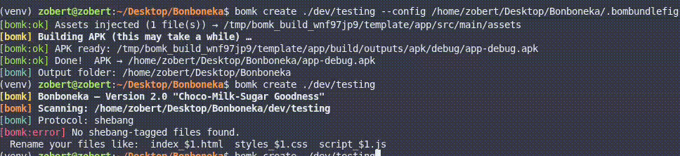
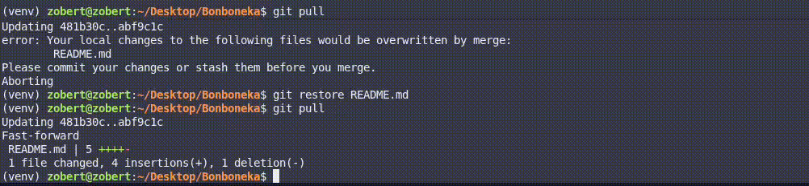

[](https://postimg.cc/GBvbsJTF)
# 🍬 Bonboneka (`bomk`)

> Bundle your HTML, CSS, and JS into a native Android WebView app — with a single command.

---

> [!WARNING]
> **B0MK CORE 3.0 is released** You may see warnings during builds if using StatiX. To suppress them, add `<div class="ignorewarnings"></div>` anywhere in your HTML.

---

## Why?

Converting a website into an Android app is genuinely painful. Bonboneka makes it a one-liner. No Android Studio, no boilerplate — just your web files and one command.

---

## Features

- **Automatic inlining** — External CSS and JS are merged into a single self-contained HTML file
- **Asset encoding** — Images are automatically converted to Base64 data URIs
- **Multi-bundle support** — Define multiple entry points using either naming convention
- **PWA mode** — Wrap any PWA URL into an installable Android APK via Capacitor

---

## Requirements

| Requirement | Notes |
|---|---|
| Python 3.10+ | Well, for installing the tool and running it. |
| Git | Required for template cloning |
| Android SDK | Required for APK compilation |
| Java JDK | Required for Gradle(building) |
|  | Required for PWA mode |

---

## Installation

**Recommended — install from your platform's instalation script**
```zsh
chmod +x ./install.sh #For macOS and Linux
```
```powershell
./install.bat #Windows
```

**Alternative — install from source or from PiPy:(same on both platforms**

```zsh
pip install -e . (inside the directory)
```

```zsh
pip install bonboneka
```


---

## Usage

```bash
bomk create <path/to/folder> [options]
```


| Option | Description |
|---|---|
| `-s`, `/s` | Silent mode — suppress all output |
| `--verbose`, `/verbose` | Verbose mode — show detailed build logs |
| `-o <dir>` | Output directory for the generated APK |
| `--icon <path>` | Custom launcher icon (PNG / JPG / WebP) |
| `--name <name>` | Override the app name shown on the launcher |
| `--config <path>` | Path to a `.bombundlefig` file (Flow protocol) |
| `--nobuild` | Skip APK build — output the prepared template instead |

---

## Naming Protocols

Bonboneka supports two protocols for declaring which files belong together.

### StatiX



The original protocol. Group membership is declared in the **filename** using a `_$N` tag.

```
my_app/
├── index_$1.html          ← Entry point (Group 1)
├── styles_$1.css
├── script_$1.js
├── start_$2.html          ← Secondary page (Group 2)
├── styleofstart_$2.css
└── backend_$2.js
```

```bash
bomk create ./my_app
```

---

### Flow *(new in 2.0)*



The modern protocol. Files have plain names. Group membership is declared in a **`.bombundlefig`** config file, and the entry-point HTML identifies itself with a `<div class="id1"></div>` marker.

```
my_app/
├── index.html             ← Entry point (Group 1) — contains <div class="id1">
├── styles.css
├── script.js
├── start.html             ← Secondary page (Group 2) — contains <div class="id2">
├── styleofstart.css
├── backend.js
└── .bombundlefig
```

`.bombundlefig`:
```json
{
  "groups": {
    "1": ["index.html", "styles.css", "script.js"],
    "2": ["start.html", "styleofstart.css", "backend.js"]
  }
}
```

```bash
bomk create ./my_app
# or, if the config is stored elsewhere:
bomk create ./my_app --config ./path/to/.bombundlefig
```

> **Note:** Group `1` is always treated as the app's primary entry point, regardless of protocol.

---

## PWA Mode

Wrap any PWA URL into an installable Android APK using Capacitor.

> ⚠️ `--encased` mode has been removed as of version 2.0.

```bash
bomk create --pwa <url>
bomk create --pwa https://example.com --name "My App" --package com.example.app
```

PWA mode uses **Capacitor**, not B0MK Core. Requires Node.js 14+ and the Capacitor CLI.

---

## `bomk doctor`

Validate a Bonboneka project and diagnose common issues.
*Note: Doctor has not been ported to the Flow protocol yet and only supports StatiX projects. I(not we,I am an single person working on this) am trying to port it asap.*

```bash
bomk doctor <path/to/project>
```

Checks for:
- Missing or misnamed files
- Incorrect protocol usage
- Missing entry-point markers (`_$1` or `<div class="id1">`)

---

## Gitlink *(beta)*

Link your template to a GitHub repository and configure auto-commit behaviour.

```bash
bomk gitlink <template> --set <url>                        # Set remote origin
bomk gitlink <template> --behaviour commit-per-build       # Auto-commit on every build
bomk gitlink <template> --behaviour manual-commit          # Commit manually
bomk gitlink <template> --commit                           # Commit pending changes
bomk gitlink <template> --push                             # Push to remote
bomk gitlink <template> --disengage                        # Reset to default origin
```

> ⚠️ Gitlink is in beta and has not undergone rigorous testing.

---

## **[NEW]** B0MK Core 3.0
Introducing the new-and-improved B0MK Core 3.0, now with Flow protocol support, improved error handling, and a shiny new codebase. It still keeps suport for StatiX, but Flow is the future.

Why am I so exited? Because Flow is a much more robust and intuitive protocol that decouples file grouping from naming conventions, making it easier to manage complex projects and avoid naming conflicts. Plus, the new codebase is cleaner and more maintainable, which means faster development and fewer bugs in the long run.

Images:

[](https://postimg.cc/wyBbd9z9)

*B0MK-CORE 3.0 no entry point error screen.(its animated)*

## Configuration

Edit `bomk/config.py` to customise the build environment:

```python
# Android project scaffold repository
TEMPLATE_REPO   = "https://github.com/YourUser/Example-Android-WV-App.git"

# Relative paths within the template
ASSETS_REL_PATH    = "app/src/main/assets"
MAIN_JAVA_REL_PATH = "app/src/main/java/exampleWV/app/Main.java"
```

---

## Version

**2.0 "Choco-Milk-Sugar Goodness"** — Flow protocol, PWA mode, `--name`, `--config`, Gitlink beta.
